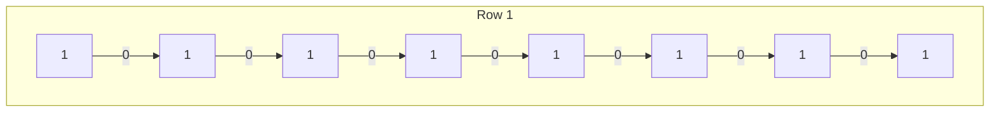
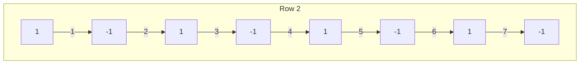
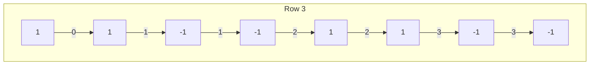
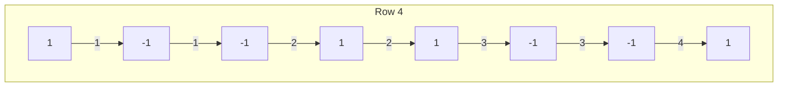
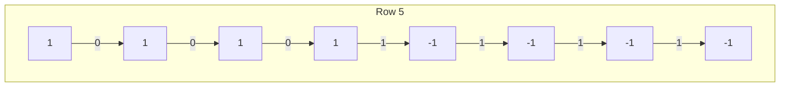
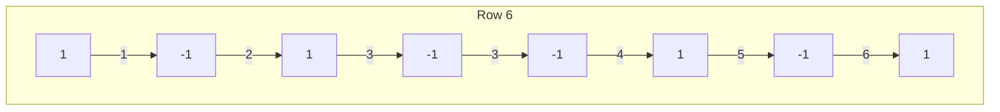
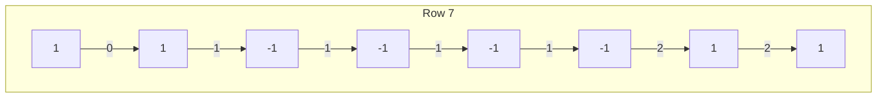
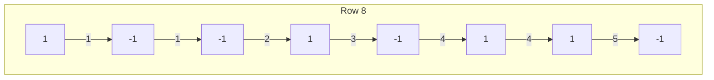

In this post, I will be discussing Hadamard Transform and use it to perform sequency domain filtering. I start with a mathematical introduction to the concept followed by a practical application implemented on a sample audio signal with Python.

Let us get started with the definitions.

## Hadamard Transform

An $2^n \times 2^n$ Hadamard matrix[^walsh-hadamard] is a matrix $H_n$ whose elements are $\pm 1$ such that

$$
H_n H_n^T = \frac{1}{2^n}I
$$

where $\frac{1}{2^n}$ is the normalization factor that can sometimes be omitted. The normalization can be applied at any stage of the transformation and is mostly a design choice: only forward, only inverse, or both forward and inverse. The important point is that the Hadamard matrix consists of ones and minus ones.

The $2 \times 2$ Hadamard matrix is

$$
\begin{bmatrix}
 1 & 1 \\
 1 & -1
\end{bmatrix}.
$$

It is possible to construct Hadamard matrices using [[Kronecker Product|Kronecker products]]. This method is called the Sylvester method[^sylvester], which formulates

$$
H_n = H_1 \otimes H_{n-1}.
$$

We can transform a signal to the Hadamard domain and apply ideal sequency domain filtering by forming a properly sized Hadamard matrix. The sequency is calculated by counting the number of sign changes in each row. Since the resulting matrix is symmetric, the sequency can also be calculated across columns and obtain the same sequencies. In any case, the sequency is unique for each row or column.

For example, consider $H_3$ of shape $8 \times 8$. Following Sylvester method, we can compute

$$
H_3 = H_1 \otimes H_2 \text{ and } H_2 = H_1 \otimes H_1.
$$

Let us omit the normalization part for simplicity and start with $H_2$. With the [[Kronecker Product|Kronecker product]], we apply scalar multiplication to the second matrix with each element of the first matrix and place the result as a partial block of the resulting matrix. Starting from top left and going to right row by row of $H_1$:

1. We have $1$ at the first index. Multiplying $H_1$ with $1$ results the same. This is the top left block.
2. We have $1$ at the second index. Top right block is also the same as $H_1$.
3. We move to the second row and again have $1$ at the third index. Bottom left block is also $H_1$.
4. The last element is $-1$. We get $-H_1$ as the bottom right block.

Following this procedure, we get

$$
H_2=
\begin{bmatrix}
	H_1 & H_1 \\
	H_1 & -H_1 
\end{bmatrix} = 
\begin{bmatrix}
	 1 & 1 & 1 & 1 \\
	 1 & -1 & 1 & -1 \\
	 1 & 1 & -1 & -1 \\
	 1 & -1 & -1 & 1 
\end{bmatrix}.
$$

Notice the blockwise repeating pattern. Similarly, we can obtain $H_3$ recursively. Repeat $H_2$ on a new matrix with the same values on the top left, right, and bottom left blocks and negate it on the remaining bottom right block. Before moving on, I provide $H_3$ for completeness.

$$
H_3=
\begin{bmatrix}
	 1 & 1 & 1 & 1 & 1 & 1 & 1 & 1 \\
	 1 & -1 & 1 & -1 & 1 & -1 & 1 & -1 \\
	 1 & 1 & -1 & -1 & 1 & 1 & -1 & -1 \\
	 1 & -1 & -1 & 1 & 1 & -1 & -1 & 1 \\
	 1 & 1 & 1 & 1 & -1 & -1 & -1 & -1 \\
	 1 & -1 & 1 & -1 & -1 & 1 & -1 & 1 \\
	 1 & 1 & -1 & -1 & -1 & -1 & 1 & 1 \\
	 1 & -1 & -1 & 1 & -1 & 1 & 1 & -1 \\
\end{bmatrix}
$$

It is possible to compute Hadamard matrices from scratch using this method. However, there are packages available both in Matlab and Python that compute it for you in practice, which I will also use.

### Sequency Computation

The sequency of each row of a Hadamard matrix is unique and will be used during filtering. We calculate the sequency by counting the number of sign change for each row. We can visualize the process in the following diagrams, where the rectangular boxes contain the values in the row and the values in the links show the iteratively increasing sequencies. The sequency is incremented if the value within the boxes switch during that step. The text within the last link is the sequency of that row.

















Pay attention to the sequency values denoted in the last link at each row. Verify that they are unique. In order, the sequencies are $0-7-3-4-1-6-2-5$. We can order the rows according to these sequencies to obtain the sequency ordered Hadamard matrix.


> [!tip]
> 
> It is desirable to have a sequency ordered matrix for filtering purposes. Yet, we can clearly see that the original Hadamard matrix is not sequency ordered. During implementation, we can run a for loop for each row and iteratively figure out the sequencies. However, running an iterative process is slow and we can do better.

> [!question]- Can you come up with a faster approach to calculate sequencies?
> 
> That's what we discuss in the next section. We will utilize vectorization.

#### Simple Algorithm to Calculate Sequencies

We can apply the following steps to easily calculate sequency of each row:

1. Create a copy of the current row and shift left by one element.
2. Sum the overlapping elements ($n-1$ elements should overlap).
3. Count the number of times where the sum is zero.
4. Record that count as the sequency of that row.
5. Repeat for each row.

Try on a simple example (you can use the $H_3$ where we already computed the sequencies) and convince yourself that these steps really give you the sequency of that row.

**Note:** This is simply one way of calculating the sequencies. There could be faster ways of doing it, or even packages doing it for you. This is a basic way of doing it with barebones arrays.

### Sequency Domain Filtering

One can transform a signal to the Hadamard domain and apply ideal sequency domain filtering by forming a properly sized Hadamard matrix. The Hadamard Transform of a signal is computed by

$$
y = Hx.
$$

The ideal filtering operation is performed by setting the elements corresponding to the desired sequencies to zero, which eliminates the effect of the basis vectors corresponding to those sequencies. The filtered signal can be reconstructed by applying the same linear transform and the scalar normalization factor[^walsh] as

$$
\hat x = cHy.
$$

## Practical Example: Sequency Domain Filtering in Python

Now that we know the basics of Hadamard matrix, we can use it to apply filtering with a hands-on example. I will be using Python and some helper packages to handle audio and array operations and allow us to visualize our observations. You can also use [Matlab](https://www.mathworks.com/products/matlab.html) to achieve the same results.

It is good practice to create a virtual environment for your project. I will use [Miniconda3](https://docs.conda.io/en/latest/miniconda.html) and the `conda` to manage my environment and Jupyter notebooks to incrementally implement the filtering. In your working environment, install the following packages by running the commands:

- `conda install -c conda-forge python-sounddevice`
- `conda install -c conda-forge pysoundfile`
- `conda install numpy`
- `conda install scipy`
- `conda install matplotlib`

If you use Jupyter notebooks, you will also need the `ipykernel` package:

- `conda install ipykernel`

Then, we can import the necessary packages:

```python
import sounddevice as sd
import soundfile as sf
import numpy as np
from scipy.io.wavfile import write
from scipy.linalg import hadamard
from matplotlib import pyplot as plt
```

### Getting the Audio Signal

We need a sample signal to filter. For brevity, I will use a 2 seconds speech signal in the `.wav` format with sampling rate $f_s=8192$ Hz. One way to obtain such a signal is to use your own microphone and record yourself uttering 2-4 words. We can use the following block:

```python
# Record audio
fs = 2**13  # Sample rate
seconds = 2  # Duration of recording

print("Starting to record...")
sound = sd.rec(int(seconds * fs), samplerate=fs, channels=1)
sd.wait()  # Wait until recording is finished
```


> [!NOTE]
> 
> We forced the audio to be 2 seconds long. If you happen to speak longer than 2 seconds, it will cut off, but it doesn't really matter. You can record it again if you wish to do so.

Now, we save it as a `.wav` file to keep the same signal if we happen to lose progress later.

```python
write("recording.wav",fs,sound)
```

After saving this audio file, you do not need to re-record it every time if something goes wrong or you take a break. Just skip the recording steps above and continue by loading the audio back from the disk:

```python
# Load the recorded audio for further steps
sound, fs = sf.read("recording.wav")
```

You can play the audio to double check if it really loaded correctly:

```python
sd.play(sound, fs)
```

### Preparing the Hadamard Matrix

We create the Hadamard matrix with the `hadamard` function from the `scipy.linalg` library:

```python
# Create the H_n Hadamard matrix where n=14
H = hadamard(2**14, dtype="int8")

# Try lowering int size if the kernel crashes.
```

Next, we compute the sequency of each row as we discussed in [[Hadamard Transform and Sequency Domain Filtering#Simple Algorithm to Calculate Sequencies|Simple Algorithm to Calculate Sequencies]]. We first define a function:

```python
"""
Compute the sequency of each row given a Hadamard matrix by:
1) Create a copy of the row and shift left by one element
2) Sum the overlapping elements (length-1 should overlap)
3) Count the number of times where the sum is zero
4) Record that count as the sequency of that row
5) Repeat for each row
"""
def compute_sequency(matrix):
    m, n = matrix.shape
    sequency = np.zeros(m)
    for i in range(m):
        row = matrix[i]
        sequency[i] = np.sum((row[0:-1] + row[1:]) == 0)

    return sequency.astype("int16") # returns the sequency vector
```

Then, use it to compute the sequencies, and also verify that each sequency element is unique:

```python
seq = compute_sequency(H)
print(f"Sequency vector is of shape {seq.shape} with "
      f"{np.unique(seq).size} unique elements")
print(f"First few elements of the sequency vector:\n{seq[0:8]}")
```

```
> Sequency vector is of shape (16384,) with 16384 unique elements
> First few elements of the sequency vector:
> [ 0 16383 8191 8192 4095 12288 4096 12287]
```

We now sort it according to increasing sequency order for ease of filtering and verify the sorted matrix really has ascending sequency:

```python
"""
Sort a given Hadamard matrix according to its sequency
Returns sequency-ordered Hadamard matrix
"""
def sort_hadamard(matrix, sequency):
    m, n = matrix.shape
    # Copy to avoid changes in the matrix passed originally
    mm = matrix.copy()
    old_row = np.arange(m)
    mm[sequency] = mm[old_row]
    return mm

H_sorted = sort_hadamard(H, seq)
seq_sorted = compute_sequency(H_sorted)
print(f"First few elements of the SORTED sequency vector:\n{seq_sorted[0:8]}")
```

```
> First few elements of the SORTED sequency vector:
> [0 1 2 3 4 5 6 7]
```

We obtained the sequency ordered Hadamard matrix ready for our ideal filtering. Great!

### Lowpass and Bandpass Filtering

With the simple simple forward and inverse linear transformations we defined in [[Hadamard Transform and Sequency Domain Filtering#Sequency Domain Filtering|Sequency Domain Filtering]], we can filter our signal. We first need to transform our signal to the Hadamard domain $y=Hx$:

```python
# Get the coefficients in Hadamard domain by y = Hx
y = np.dot(H_sorted, sound)
```

We will apply both lowpass and bandpass filtering and observe the results. For the low pass filtering, we will filter out half of the highest sequency elements. We will also apply multiple stages and remove top half of the remaining half elements in each stage. Therefore:

- Stage 0 LPF (no filtering, original signal): All coefficients are present
- Stage 1 LPF: Lowest 1/2 coefficients are present
- Stage 2 LPF: Lowest 1/4 coefficients are present
- Stage 3 LPF: Lowest 1/8 coefficients are present
- Stage 4 LPF: Lowest 1/16 coefficients are present
- Stage 5 LPF: Lowest 1/32 coefficients are present

For the bandpass filtering, we will keep the center half of the coefficients and remove the lowest and highest quarter of the coefficients. Therefore:

- Stage 0 BPF (no filtering, original signal): All coefficients are present
- Stage 1 BPF: Center 1/2 coefficients are present
- Stage 2 BPF: Center 1/4 coefficients are present
- Stage 3 BPF: Center 1/8 coefficients are present
- Stage 4 BPF: Center 1/16 coefficients are present
- Stage 5 BPF: Center 1/32 coefficients are present

After each stage, we will also reconstruct the signals and compare them with the original signal. But first, we compute the indices for LPF and BPF to filter out the coefficients.  We set the coefficients outside the desired range to $0$ for ideal filtering:

```python
# LPF indices
lpf_indices = np.around(np.flip(np.geomspace(1, 2**4, 5) * 2**9)).astype(int)

# Apply low-pass filtering by setting elements above `threshold` to zero
def lpf(y, threshold):
    yy = y.copy()
    yy[threshold:] = 0
    # print(np.sum(yy == 0)) # sanity check
    return yy

y_lpf = [lpf(y, lpf_idx) for lpf_idx in lpf_indices]

# BPF indices
bpf_indices = np.cumsum(lpf_indices)

# Apply band-pass filtering by setting below `threshold/2` and above
# `-threshold/2` to zero
def bpf(y, threshold):
    yy = y.copy()
    yy[0:threshold//2] = 0
    yy[-threshold//2:] = 0
    # print(np.sum(yy == 0)) # sanity check
    return yy

y_bpf = [bpf(y, bpf_idx) for bpf_idx in bpf_indices]
```

All of these signals are in Hadamard domain. We transform it again with the inverse Hadamard Transform to get the filtered speech signal back:

```python
"""
Apply the inverse Hadamard transform xhat=Hy
For a given full Hadamard matrix it should be xhat=x because:
H=H^(-1) -> xhat = Hy = H(Hx) = H^(-1)(Hx) = x
"""
def inv_hadamard(signal, H):
    x = np.dot(H, signal)
    # Normalize as if the original Hadamard was orthonormal
    scale = signal.size
    return x / scale

xhat = inv_hadamard(y, H_sorted)
x_lpf = [inv_hadamard(y, H_sorted) for y in y_lpf]
x_bpf = [inv_hadamard(y, H_sorted) for y in y_bpf]
```

This concludes the filtering operation. Next, we discuss the results and compare the two filtering approaches.

### Analysis of the Reconstructed Signals

Let us first verify that the original signal is reconstructed with no loss by applying the inverse transform by plotting them side by side.

```python
# Plot the original signal
fig, ax = plt.subplots(1,2, sharey=True)
ax[0].plot(sound, label='x[n]')
ax[0].set_xlabel(r'Sample index $n$')
ax[0].set_ylabel('Amplitude')
ax[0].legend(loc='upper right')

# Plot the reconstructed signal which is:
# y = Hx
# xhat = Hy
ax[1].plot(xhat, label='x[n] reconstructed')
ax[1].set_xlabel(r'Sample index $n$')
ax[1].set_ylabel('Amplitude')
ax[1].legend(loc='upper right')

fig.set_size_inches(6.4*2, 4.8)
fig.tight_layout()
fig.savefig("hadamard-1" + '.png', dpi=100)
plt.show()
```

The speech signal seems to be perfectly reconstructed. We can also verify it elementwise in code.

![[hadamard-1.png]]

Let us now look at the filtered signals at every stage generated by the code:

```python
"""
Plot a typical segment of filtered and original signal
"""
fig, axes = plt.subplots(2,5, sharey=True)

# Plot within this range
start = 4000
stop = 4300
n = np.arange(start, stop)

# Plot the lowpass filtered signals in the first row
row = 0
for idx, xlp in enumerate(x_lpf):
    axes[row, idx].plot(n, sound[start:stop], color="royalblue", label=r'$x[n]$')
    axes[row, idx].plot(n, xlp[start:stop], color="darkorange", label=r'$\hat{x}[n]$')
    # axes[row, idx].set_xlabel(r'Sample index $n$')
    # axes[row, idx].set_ylabel('Amplitude')
    axes[row, idx].set_title(f"LPF Stage {idx+1}")
    axes[row, idx].legend(loc='lower right')

# Plot the bandpass filtered signals in the second row
row = 1
for idx, xbp in enumerate(x_bpf):
    axes[row, idx].plot(n, sound[start:stop], color="royalblue", label=r'$x[n]$')
    axes[row, idx].plot(n, xbp[start:stop], color="darkorange", label=r'$\hat{x}[n]$')
    # axes[row, idx].set_xlabel(r'Sample index $n$')
    # axes[row, idx].set_ylabel('Amplitude')
    axes[row, idx].set_title(f"BPF Stage {idx+1}")
    axes[row, idx].legend(loc='lower right')

fig.set_size_inches(6.4*2*2, 4.8*2)
# fig.supylabel("Amplitude")
axes[0,0].set_ylabel('Amplitude')
axes[1,0].set_ylabel('Amplitude')
fig.supxlabel(r"Sample index $n$")
fig.tight_layout()
fig.savefig("hadamard-3" + '.png', dpi=200)
plt.show()
```

![[hadamard-3.png]]

The top and bottom rows correspond to the stages of lowpass and the bandpass filtering respectively. We only plot a small portion of the original signal for clarity. You can zoom into the image if you wish to take a closer look (the image is pretty high resolution). We can make some observations:

- As expected, we lose more and more information from the original signal and the reconstruction quality gets worse as we filter out more coefficients in both cases.
- However, it looks like the reconstruction quality is worse at the first stage for the bandpass filter.
- Bandpass reconstructions are more oscillatory compared to lowpass stages.

Remember that we removed half of the remaining coefficients in both cases. So, we lost half of the basis vectors and reduced the necessary storage size by the same amount. Yet, the reconstruction is more accurate in the lowpass filter.

We can further analyze this issue by looking at the magnitues of Hadamard coefficients obtained from the sequency sorted matrix:

```python
# Plot the original signal
fig, ax = plt.subplots()

# Plot the Hadamard coefficients y
ax.stem(np.abs(y/np.sqrt(y.size)), label='y[n]', markerfmt=" ",
        basefmt=" ", use_line_collection=True)
ax.set_xlabel(r'Sequency index $n$')
ax.set_ylabel('Magnitude')
ax.legend(loc='upper right')

fig.set_size_inches(6.4*2, 4.8)
fig.tight_layout()
fig.savefig("hadamard-2" + '.png', dpi=100)
plt.show()
```

![[hadamard-2.png]]

In this plot, we observe the magnitudes of each Hadamard coefficient in the increasing sequency order. Notice that more of the larger coefficients are concentrated on the lower sequencies. In the first stage of LPF, we kept the leftmost half and set the rightmost half to 0, effectively removing the highest frequency components from the signal. In the first stage of BPF, we kept the center half and set the leftmost and rightmost quarter of coefficients to zero, removing those frequency components from the signal. We lost much more information about the signal in the BPF case. We can verify this by computing the total energy of the original signal and compare it with the energies of the filtered signals:

```python
# Print the components of the table in the report - formatted
def compute_energy(signal):
    sabs = np.abs(signal/np.sqrt(signal.size))
    return np.sum(sabs**2)

# First line which the total energy
ynrg = compute_energy(y)
print(f"{0} & {ynrg:.2f} & {ynrg/ynrg * 100:.1f} & {ynrg:.2f} & {ynrg/ynrg * 100:.1f} \\\\")

# Rest of the lines
for i in range(len(y_lpf)):
    lpfnrg = compute_energy(y_lpf[i])
    bpfnrg = compute_energy(y_bpf[i])
    print(f"{i+1} & {lpfnrg:.2f} & {lpfnrg/ynrg * 100:.2f} & {bpfnrg:.2f} & {bpfnrg/ynrg * 100:.2f} \\\\")
```

| Stage | LPF     |  | BPF |  |
|-------|---------|--------|-----|--------|
|       | Energy  | %Total Energy | Energy | %Total Energy |
| 0     | 88.95   | 100.0         | 88.95  | 100.0          |
| 1     | 80.50   | 90.50         | 25.31  | 28.45          |
| 2     | 60.44   | 67.94         | 10.02  | 11.26          |
| 3     | 37.75   | 42.44         | 1.65   | 1.86           |
| 4     | 15.23   | 17.12         | 0.78   | 0.87           |
| 5     | 5.57    | 6.26          | 0.38   | 0.43           |

Look at the first stage results: The LPF kept more than 90% of the total energy while the BPF only kept 28.5% of the original energy. We effectively lost more information about the original signal by removing the low frequency components because we have verified that we have a lot more low frequency components in the signal compared to high frequency components.

The second stage does not look good for BPF either. Only 11% remains while the LPF kept almost 68%. And after the third stage, the signal is basically gone for BPF.

> [!TODO] Try it yourself!
> 
> You can listen to the filtered audio signals and verify these observations yourself.

## Conclusion

In this post, I made a brief introduction to Walsh-Hadamard Transform and provided a simple example that you can follow. I can summarize this work as follows:

- We applied sequency domain filtering with **Hadamard Transform** and attempted to **reconstruct** the original signal after applying **sequency domain filtering**.
- Only **partial reconstructions** of the original signal were possible because we lost some information about the signal at each stage.
- We observed that some coefficients contain more **"information"** about the signal. The choice of which **basis vector coefficients** to keep significantly affects the quality of the reconstructed signal via the inverse transform.

As a final remark, we can utilize Hadamard Transform for signal compression by intelligently choosing the basis vectors we keep.

## Further Reading and Resources

If you are interested and looking for more sources to read, check these out:

- Matlab documentation about [Walsh-Hadamard Transform](https://www.mathworks.com/help/signal/ug/walshhadamard-transform.html)
- Matlab tutorial on [Walsh-Hadamard Transform for Spectral Analysis and Compression of ECG Signals](https://www.mathworks.com/help/signal/ug/walsh-hadamard-transform-for-spectral-analysis-and-compression-of-ecg-signals.html)
- Alternatively, take a look at the resources I cited in the footnotes


> [!info] Code
> 
> You can download the code in this page as a `.ipynb` file. Note that you have to provide the audio yourself and your results will surely change. I provide the code as is and it is in your responsibility to verify its functionality.
> 
> - Zip File: [[junctionpoint-hadamard-sequency.zip]]
> - GitHub: https://github.com/JunctionPoint/hadamard-sequency

## Citation

Please provide a link to this page if you use it in your own work.

> Junction Point. Hadamard Transform and Sequency Domain Filtering. https://junctionpoint.github.io/Hadamard-Transform-and-Sequency-Domain-Filtering.

[^walsh-hadamard]: Todd K Moon and Wynn C Stirling. Mathematical methods and algorithms for signal processing, volume 1, chapter Some applications of Kronecker products. Prentice hall Upper Saddle River, NJ, 2000.
[^sylvester]: G Beauchamp. Applications of walsh and related functions. with an introduction to sequence theory: Academic press, inc., microelectronics and signal processing series, 24–28 oval road, london nw1 7dx and orlando, fl 32887, 1984, xvi+ 308 pp., isbn 0-12-084180-0, 1985.
[^walsh]: Tom Beer. Walsh transforms. American Journal of Physics, 49(5):466–472, 1981.